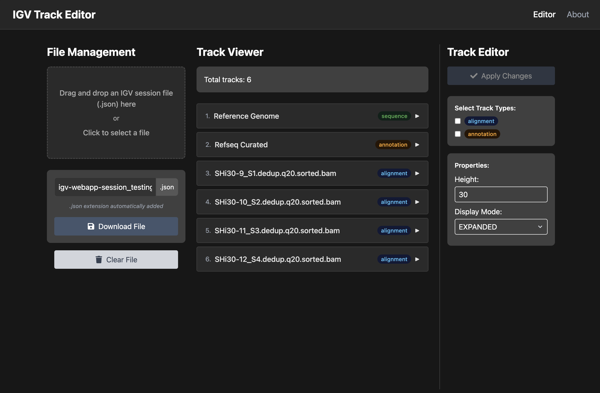

# IGV Track Editor

A simple tool to edit IGV session files.
Allows editing multiple tracks at once. It's a pain to set the height of each track individually in IGV, for example, so this is my attempt at a solution.

